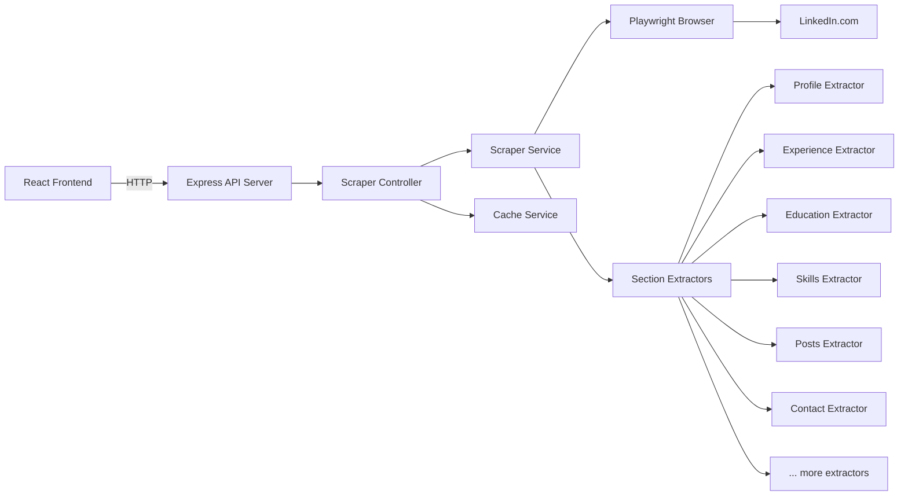
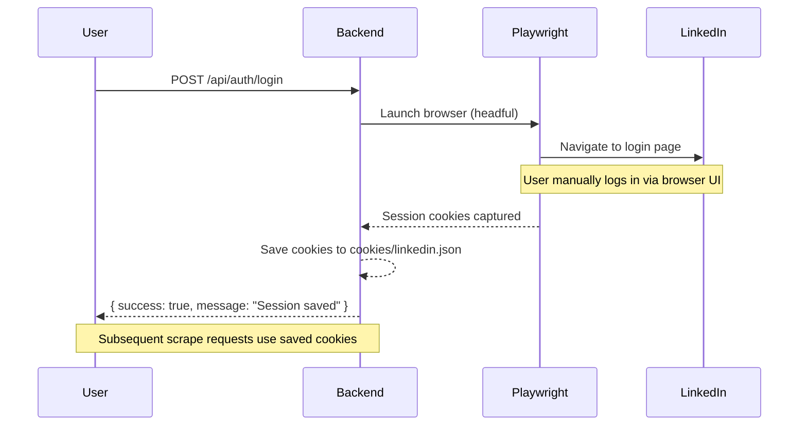

# LinkedIn Profile Scraper — Implementation Plan (Playwright-Only)

A full-stack LinkedIn scraper using **Playwright** (headless browser) for deep, exhaustive profile data extraction. Backend in **Node.js + Express**, frontend in **React + Vite**.

> [!CAUTION]
> **LinkedIn ToS**: Automated scraping violates LinkedIn's User Agreement. This tool is for educational/personal research use only. Direct scraping risks account bans, IP blocks, and legal action. Use responsibly.

---

## How It Works

Playwright launches a headless Chromium browser, authenticates with LinkedIn using saved cookies/session, navigates to a profile URL, and systematically extracts **every visible section** by scrolling, expanding "Show more" buttons, and parsing the DOM. Anti-detection measures (stealth plugin, human-like delays, fingerprint spoofing) minimize bot detection.

### Data Points Extracted (Exhaustive)

| Category | Data Points |
|---|---|
| **Profile Header** | Full name, headline, location, profile photo URL, banner image URL, connection count, follower count, open-to-work badge |
| **About** | Full summary/about text |
| **Experience** | Job title, company name, company logo, employment type, location, date range, duration, description (for each role) |
| **Education** | School name, school logo, degree, field of study, dates, grade, activities/societies, description |
| **Skills** | Skill name, endorsement count (top skills + all skills via "Show all" expansion) |
| **Recommendations** | Recommender name, relationship, text (both received & given) |
| **Certifications** | Name, issuing organization, issue date, credential ID, credential URL |
| **Languages** | Language name, proficiency level |
| **Honors & Awards** | Title, issuer, date, description |
| **Publications** | Title, publisher, date, URL, description |
| **Volunteer** | Role, organization, cause, date range, description |
| **Projects** | Name, date range, description, associated with |
| **Courses** | Course name, course number |
| **Organizations** | Name, position, date range, description |
| **Posts & Activity** | Post text, post images (all URLs), post date, reactions count, comments count, reposts count |
| **Contact Info** | Email, phone, websites, birthday, connected date (if visible) |
| **Profile Images** | Profile photo (full-res), banner image, all post images, company logos |

---

## Architecture



---

## Project Structure

```
Linkedin/
├── backend/
│   ├── package.json
│   ├── .env.example
│   ├── server.js                          # Express entry point
│   ├── config/
│   │   └── index.js                       # Centralized config
│   ├── routes/
│   │   ├── scraper.routes.js              # Scraping endpoints
│   │   └── auth.routes.js                 # Cookie/session management
│   ├── controllers/
│   │   ├── scraper.controller.js          # Request handlers
│   │   └── auth.controller.js             # Login/cookie persistence
│   ├── services/
│   │   ├── browser.service.js             # Playwright browser lifecycle
│   │   ├── scraper.service.js             # Orchestrates full profile scrape
│   │   ├── cache.service.js               # In-memory TTL cache
│   │   └── extractors/                    # Per-section DOM extractors
│   │       ├── profile.extractor.js       # Name, headline, photo, about
│   │       ├── experience.extractor.js    # Work history
│   │       ├── education.extractor.js     # Education history
│   │       ├── skills.extractor.js        # Skills + endorsements
│   │       ├── recommendations.extractor.js
│   │       ├── certifications.extractor.js
│   │       ├── posts.extractor.js         # Activity feed + images
│   │       ├── contact.extractor.js       # Contact info overlay
│   │       ├── accomplishments.extractor.js # Languages, honors, pubs, etc.
│   │       └── images.extractor.js        # All image URLs aggregation
│   ├── middleware/
│   │   ├── rateLimiter.js
│   │   └── errorHandler.js
│   ├── utils/
│   │   ├── logger.js                      # Winston logger
│   │   ├── delay.js                       # Human-like random delays
│   │   ├── scroll.js                      # Smart scrolling helpers
│   │   └── validators.js                  # URL validation
│   └── cookies/                           # Persisted session cookies (gitignored)
│       └── .gitkeep
├── frontend/
│   ├── package.json
│   ├── index.html
│   ├── vite.config.js
│   └── src/
│       ├── main.jsx
│       ├── App.jsx
│       ├── App.css
│       ├── index.css                      # Design system tokens
│       ├── components/
│       │   ├── SearchBar.jsx              # URL input + scrape trigger
│       │   ├── ProfileHeader.jsx          # Photo, name, headline, stats
│       │   ├── AboutSection.jsx           # Summary text
│       │   ├── ExperienceTimeline.jsx     # Work history timeline
│       │   ├── EducationSection.jsx       # Education cards
│       │   ├── SkillsGrid.jsx             # Skills tag cloud
│       │   ├── PostsFeed.jsx              # Activity posts with images
│       │   ├── RecommendationsSection.jsx # Recommendations cards
│       │   ├── CertificationsSection.jsx  # Certifications list
│       │   ├── AccomplishmentsSection.jsx # Languages, honors, etc.
│       │   ├── ContactInfo.jsx            # Contact details
│       │   ├── ImageGallery.jsx           # All scraped images
│       │   ├── LoadingState.jsx           # Skeleton loader
│       │   ├── ErrorDisplay.jsx
│       │   └── ExportButton.jsx           # Export scraped data as JSON
│       └── services/
│           └── api.js                     # Axios HTTP client
└── implementation_plan.md
```

---

## Proposed Changes

### Backend — Browser & Stealth Layer

#### [NEW] [browser.service.js](file:///c:/Users/KIIT/Downloads/Linkedin/backend/services/browser.service.js)

Core Playwright browser manager:
- Uses `playwright-extra` + `stealth plugin` to mask automation fingerprints
- Hides `navigator.webdriver`, spoofs plugins, user-agent rotation
- Manages a singleton browser instance (reused across requests)
- Loads persisted cookies from `cookies/` directory for authenticated sessions
- Saves cookies after successful login for reuse
- Configurable viewport, locale, timezone to mimic real user
- Headful mode option for debugging

#### [NEW] [utils/delay.js](file:///c:/Users/KIIT/Downloads/Linkedin/backend/utils/delay.js)

Human-like delay utilities:
- `randomDelay(min, max)` — random wait between actions
- `typeWithDelay(page, selector, text)` — types character by character with variable speed
- Prevents bot-detection by simulating natural interaction timing

#### [NEW] [utils/scroll.js](file:///c:/Users/KIIT/Downloads/Linkedin/backend/utils/scroll.js)

Smart scrolling:
- `scrollToBottom(page)` — incrementally scrolls to load lazy content
- `scrollToSection(page, sectionId)` — scrolls to a specific section
- Random scroll speeds and pauses to mimic human behavior
- Triggers lazy-loaded images and "Show more" sections

---

### Backend — Section Extractors

Each extractor is a focused module that knows how to find and parse one section of the LinkedIn profile DOM.

#### [NEW] [extractors/profile.extractor.js](file:///c:/Users/KIIT/Downloads/Linkedin/backend/services/extractors/profile.extractor.js)

Extracts from the profile header and about section:
- Name, headline, location from top card
- Profile photo URL (full resolution from `img` tag)
- Banner image URL
- Connections & followers count
- Open-to-work status
- About/summary text (clicks "See more" if truncated)

#### [NEW] [extractors/experience.extractor.js](file:///c:/Users/KIIT/Downloads/Linkedin/backend/services/extractors/experience.extractor.js)

Extracts all work experience:
- Navigates to `#experience` section anchor
- Clicks "Show all experiences" if available
- For each role: title, company, logo URL, type, location, dates, duration, description
- Handles grouped roles under same company

#### [NEW] [extractors/education.extractor.js](file:///c:/Users/KIIT/Downloads/Linkedin/backend/services/extractors/education.extractor.js)

Extracts all education entries:
- School name, logo, degree, field, dates, grade, activities, description
- Clicks "Show all education" if needed

#### [NEW] [extractors/skills.extractor.js](file:///c:/Users/KIIT/Downloads/Linkedin/backend/services/extractors/skills.extractor.js)

Extracts skills:
- Top 3 skills from profile page
- Clicks "Show all skills" to navigate to full skills page
- Extracts all skill names + endorsement counts
- Groups by category if available

#### [NEW] [extractors/recommendations.extractor.js](file:///c:/Users/KIIT/Downloads/Linkedin/backend/services/extractors/recommendations.extractor.js)

Extracts recommendations (received and given):
- Clicks "Show all recommendations"
- Recommender name, title, relationship, recommendation text
- Tabs between "Received" and "Given"

#### [NEW] [extractors/certifications.extractor.js](file:///c:/Users/KIIT/Downloads/Linkedin/backend/services/extractors/certifications.extractor.js)

Extracts certifications: name, org, issue date, expiration, credential ID/URL.

#### [NEW] [extractors/posts.extractor.js](file:///c:/Users/KIIT/Downloads/Linkedin/backend/services/extractors/posts.extractor.js)

Extracts recent activity/posts:
- Navigates to the Activity section or `{profileUrl}/recent-activity/all/`
- Scrolls to load multiple posts
- For each post: text content, all image URLs, reactions count, comments count, reposts count, post date
- Downloads/stores full-resolution image URLs

#### [NEW] [extractors/contact.extractor.js](file:///c:/Users/KIIT/Downloads/Linkedin/backend/services/extractors/contact.extractor.js)

Extracts contact info overlay:
- Clicks "Contact info" link on profile
- Extracts: email, phone, websites/links, birthday, connected date
- Closes the overlay after extraction

#### [NEW] [extractors/accomplishments.extractor.js](file:///c:/Users/KIIT/Downloads/Linkedin/backend/services/extractors/accomplishments.extractor.js)

Extracts remaining sections: languages, honors/awards, publications, volunteer experience, projects, courses, organizations.

#### [NEW] [extractors/images.extractor.js](file:///c:/Users/KIIT/Downloads/Linkedin/backend/services/extractors/images.extractor.js)

Aggregates all image URLs from the scraped data:
- Profile photo, banner, company logos, post images
- Optionally downloads images to local storage

---

### Backend — API Layer

#### [NEW] [scraper.service.js](file:///c:/Users/KIIT/Downloads/Linkedin/backend/services/scraper.service.js)

Orchestrator that:
1. Gets a browser page from `browser.service`
2. Navigates to the LinkedIn profile URL
3. Calls each extractor in sequence with appropriate scrolling/delays
4. Aggregates results into a unified JSON response
5. Caches the result

#### [NEW] [scraper.controller.js](file:///c:/Users/KIIT/Downloads/Linkedin/backend/controllers/scraper.controller.js)

Express request handlers:
- `GET /api/scrape/profile?url=...` — Full profile scrape (all sections)
- `GET /api/scrape/posts?url=...` — Posts only
- `GET /api/scrape/images?url=...` — All images
- `GET /api/scrape/complete?url=...` — Everything combined
- `POST /api/auth/login` — Trigger LinkedIn login & save cookies
- `GET /api/auth/status` — Check if valid session exists

#### [NEW] [auth.controller.js](file:///c:/Users/KIIT/Downloads/Linkedin/backend/controllers/auth.controller.js)

Handles LinkedIn authentication:
- Opens LinkedIn login page in Playwright
- User provides credentials via API (or manual login in headful mode)
- Saves session cookies to `cookies/linkedin.json`
- Reloads cookies on subsequent requests

---

### Backend — Infrastructure

#### [NEW] [server.js](file:///c:/Users/KIIT/Downloads/Linkedin/backend/server.js)

Express server: CORS, JSON parsing, Helmet, routes, error handler, port 5000.

#### [NEW] [config/index.js](file:///c:/Users/KIIT/Downloads/Linkedin/backend/config/index.js)

Env config: `PORT`, `CACHE_TTL`, `HEADLESS` (true/false), `RATE_LIMIT_*`, `COOKIES_PATH`.

#### [NEW] [cache.service.js](file:///c:/Users/KIIT/Downloads/Linkedin/backend/services/cache.service.js)

`node-cache` based TTL cache keyed by profile URL.

#### [NEW] [middleware/rateLimiter.js](file:///c:/Users/KIIT/Downloads/Linkedin/backend/middleware/rateLimiter.js) & [errorHandler.js](file:///c:/Users/KIIT/Downloads/Linkedin/backend/middleware/errorHandler.js)

Rate limiting (30 req/15 min) and global error handling.

---

### Frontend — React Dashboard

#### [NEW] [frontend/](file:///c:/Users/KIIT/Downloads/Linkedin/frontend/)

Vite + React app with dark-themed, glassmorphism UI:

- **SearchBar** — LinkedIn URL input with validation, scrape button with loading state
- **ProfileHeader** — Large profile photo, banner, name, headline, stats
- **AboutSection** — Full summary with expandable text
- **ExperienceTimeline** — Vertical timeline with company logos
- **EducationSection** — Cards with school logos, degrees, dates
- **SkillsGrid** — Animated tag cloud with endorsement badges
- **PostsFeed** — Scrollable feed with image carousels, engagement metrics
- **RecommendationsSection** — Quote-style cards
- **CertificationsSection** — Badge-style list
- **AccomplishmentsSection** — Collapsible sections for languages, honors, etc.
- **ContactInfo** — Icons with contact details
- **ImageGallery** — Lightbox gallery of all scraped images
- **ExportButton** — Download full scraped data as JSON
- **LoadingState** — Skeleton loaders during scraping

**Design**: Dark mode (#0a0a0f base), glassmorphism cards, Inter font, gradient accent (purple-blue), micro-animations, responsive layout.

---

## Key Dependencies

| Package | Purpose |
|---|---|
| `express` | HTTP server |
| `playwright` | Headless browser automation |
| `playwright-extra` | Plugin system for Playwright |
| `puppeteer-extra-plugin-stealth` | Anti-detection (works with playwright-extra) |
| `node-cache` | In-memory TTL caching |
| `express-rate-limit` | Rate limiting |
| `helmet` | Security headers |
| `cors` | Cross-origin support |
| `winston` | Structured logging |
| `dotenv` | Environment management |

---

## Authentication Flow



> [!TIP]
> The safest auth approach is **manual login in headful mode** — the backend opens a visible browser, you log in manually, and it saves the cookies. No credentials stored in code.

---

## Verification Plan

### Automated Tests
```bash
# Start backend
cd c:\Users\KIIT\Downloads\Linkedin\backend
node server.js

# Test health
curl http://localhost:5000/api/health

# Test auth status
curl http://localhost:5000/api/auth/status

# Test full profile scrape (after login)
curl "http://localhost:5000/api/scrape/complete?url=https://www.linkedin.com/in/williamhgates"
```

### Browser Tests
- Open frontend at `http://localhost:5173`
- Enter a LinkedIn profile URL
- Verify all sections render: profile header, about, experience, education, skills, posts, images
- Test the JSON export button
- Test error states (invalid URL, no session)

### Manual Verification
1. Scrape a well-known public profile and compare data against the live profile
2. Verify all images are valid URLs by loading them
3. Test rate limiter with rapid requests
4. Test cache by scraping the same profile twice (second should be instant)
5. Verify cookie persistence across server restarts
